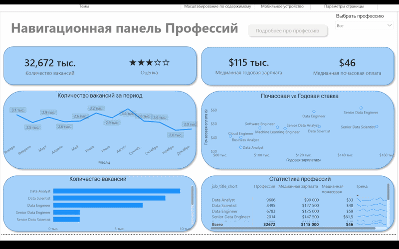
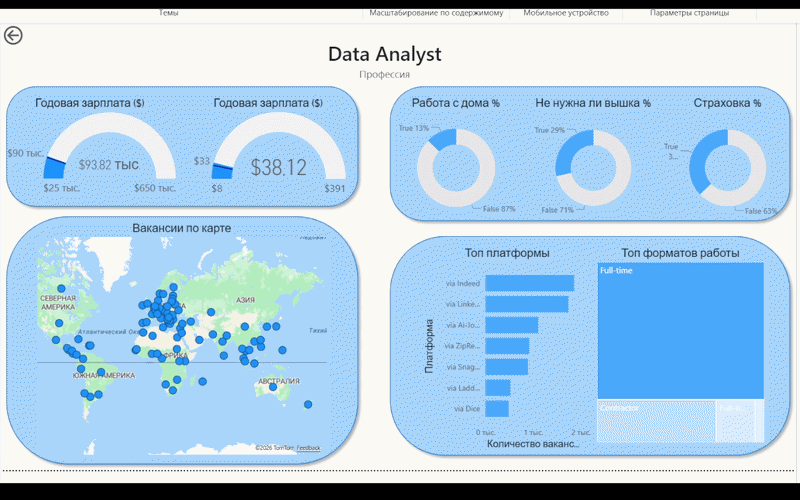

# Data Jobs Dashboard w/ Power BI

> 📊 Interactive version coming soon

---

## Introduction

This dashboard was created for **Job Seekers, Job Transitioners, and Job Swappers** to explore the data job market in a clear and interactive way.

---

## Dashboard Overview

*This report is split into two distinct pages to provide both a high-level summary and a detailed analysis.*

---

### Page 1: High-Level Market View

This page shows key KPIs like total job count, salary trends, and top roles.

---

### Page 2: Detailed View

This page allows deeper analysis with drill-through, maps, and detailed metrics.

---

## Conclusion

This dashboard demonstrates how Power BI can transform raw data into actionable insights.