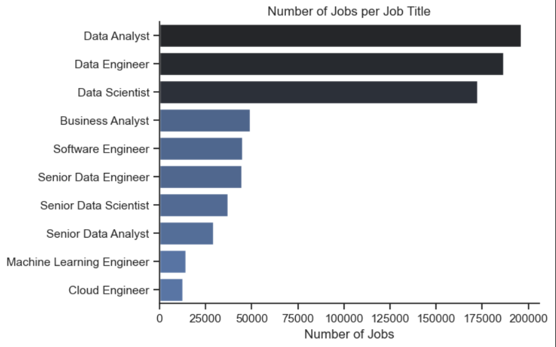
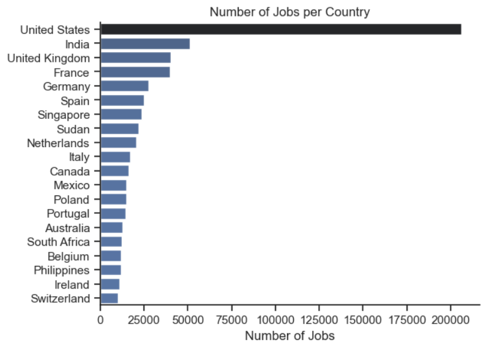
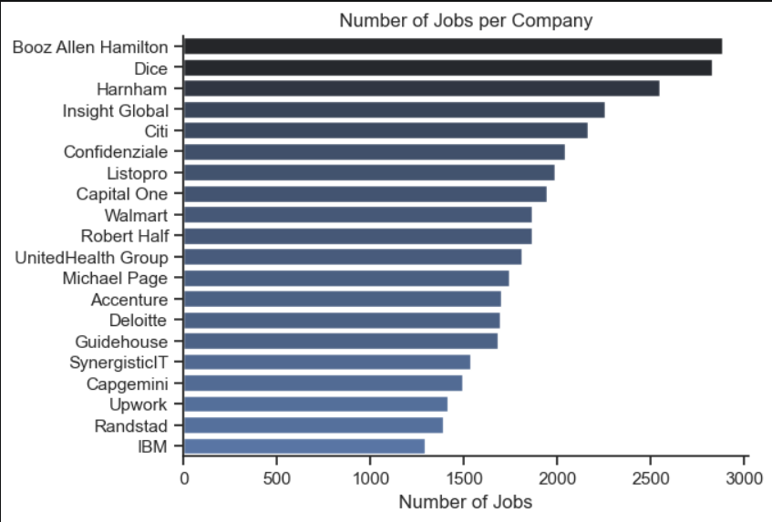
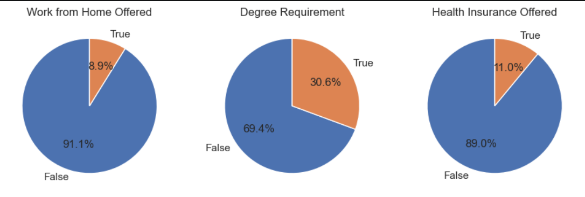
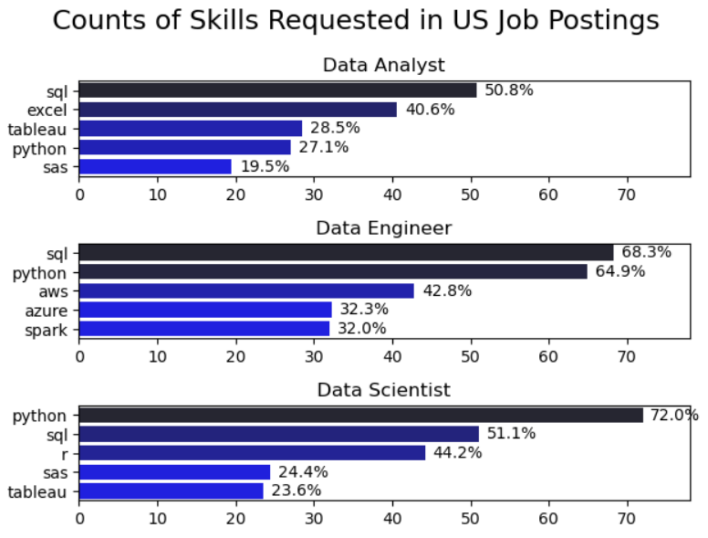
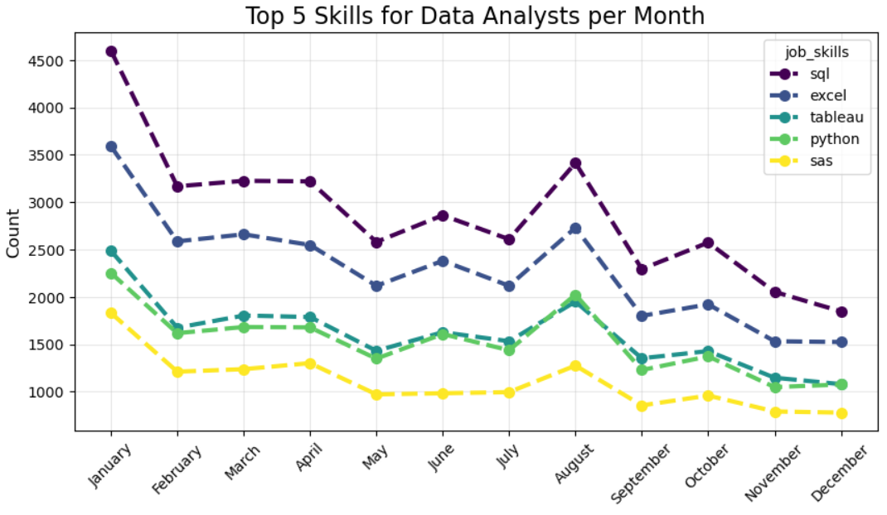

# 📊 Data Jobs Market Analysis

> **Dataset:** [`lukebarousse/data_jobs`](https://huggingface.co/datasets/lukebarousse/data_jobs) — real-world job postings in the data field from around the globe  
> **Stack:** Python · Pandas · Seaborn · Matplotlib · HuggingFace Datasets

---

## About

This project is my attempt to understand what the data job market actually looks like. Which roles are most common? What skills do employers care about? How does demand for specific tools shift throughout the year? I broke the analysis into three sequential notebooks, each building on the previous one.

---

## Project Structure

```
📁 Project N1 Python/
├── imgs/
│   ├── NumOfJobsperTitle.png
│   ├── NumOfJobsperCountry.png
│   ├── NumberOfJobsperCompany.png
│   ├── 4_jobs_conditions.png
│   ├── skillCounts.png
│   └── TrendLine.png
├── 1_EDA.ipynb
├── 2_skillsDemand.ipynb
├── 3_SkillsTrend.ipynb
└── README.md
```

---

## Notebook 1 — Exploratory Data Analysis

### What I did

The first notebook is all about getting to know the data. I loaded the dataset via HuggingFace, cleaned it up (parsed dates, converted skill strings back into Python lists using `ast.literal_eval`), and started asking basic questions: who's hiring, where, and how much.

### Charts

**Chart 1 — Number of Job Postings by Role**



Data Analyst, Data Engineer, and Data Scientist dominate the listings. Senior roles are also well represented as separate categories, which shows the market has a clear career ladder.

---

**Chart 2 — Number of Job Postings by Country**



The US leads by a huge margin. This shapes the rest of the analysis — most insights from notebooks 2 and 3 reflect the American market specifically.

---

**Chart 3 — Top Companies by Job Postings**



Many of the top "companies" are actually job aggregator platforms rather than direct employers. This reveals something about how the dataset was collected — it was scraped from job boards.

---

**Chart 4 — Job Conditions Overview**



Three pie charts covering binary job attributes:
- **Remote work:** offered in only ~10% of postings
- **Degree requirement:** most postings don't explicitly require one — good news for self-taught folks
- **Health insurance:** rarely mentioned, likely a data gap rather than reality

### Key Insights

- The market is heavily concentrated in the US — all further analysis focuses there
- Remote work is less common than you might expect post-2020
- A formal degree is not required in the majority of postings

---

## Notebook 2 — Skills Demand

### What I did

Here I narrowed the focus to US postings and dug into which tools and technologies employers actually ask for. I exploded the skills column (each skill became its own row), then counted frequencies per skill-role pair.

I also normalized raw counts against total postings per role to get a **percentage of job postings** mentioning each skill. This is more honest than raw numbers — otherwise roles with more postings would always dominate.

### Chart

**Top 5 Skills by Count & Likelihood**



Top 5 skills for the three most common roles (Data Analyst, Data Engineer, Data Scientist) — both by raw count and as a percentage of all postings for that role.

### Key Insights

- **SQL** is a must-have for Data Analysts — appears in over half of all postings
- **Python** dominates for Data Scientists and Engineers
- **Excel** holds a surprisingly strong position for analysts even in 2023
- Cloud tools (AWS, Azure) matter far more for Engineers than Analysts
- Normalization completely changes the story compared to raw counts

---

## Notebook 3 — Skills Trend Over Time

### What I did

The final notebook asks: does skill demand actually shift throughout the year? I filtered down to Data Analyst postings in the US, extracted the posting month, and built a pivot table (months × skills). Then I filtered to the top 5 skills by total annual count and plotted the trend.

### Chart

**Top 5 Skills for Data Analysts by Month**



A line chart with markers per month. Shows seasonality and the relative stability of demand for core tools across the year.

### Key Insights

- Demand for core skills (SQL, Excel, Python) is **stable year-round** — no dramatic spikes or drops
- A slight dip is visible in summer months (July–August), likely reflecting general hiring seasonality
- SQL holds the #1 spot every single month without exception
- Tableau and Power BI track closely — roughly equal demand for both BI tools

---

## Skills Demonstrated

| Category | Tools & Techniques |
|---|---|
| **Data loading** | `HuggingFace Datasets`, importing to `pandas`, string parsing with `ast.literal_eval` |
| **Data cleaning** | Date parsing (`pd.to_datetime`), handling `NaN`, `.explode()` for list-valued columns |
| **Aggregation** | `groupby`, `value_counts`, `pivot_table`, DataFrame merging |
| **Normalization** | Computing skill likelihood as a percentage of total postings per role |
| **Visualization** | `Seaborn` (barplot), `Matplotlib` (pie charts, line plots, subplots, `tight_layout`) |
| **Time series** | Extracting month from datetime, grouping by time, trend visualization |
| **Analytical thinking** | Distinguishing absolute vs. relative metrics, interpreting distributions |

---


*Dataset provided by [Luke Barousse](https://huggingface.co/lukebarousse).*