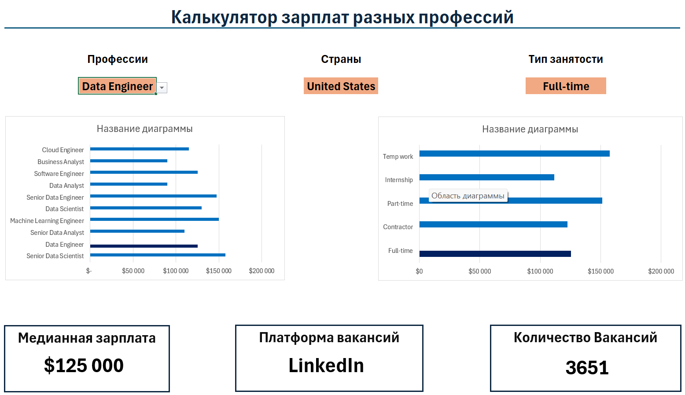

# 📊 Data Jobs Salary Dashboard (Excel)
 


 
---
 
## 📌 Overview
 
This project is an interactive **Excel dashboard** designed to analyze and visualize salary trends across various data-related jobs.
 
It helps users understand how salaries differ based on:
- Job title  
- Country  
- Job schedule type  
The goal is to provide a simple but powerful tool for exploring compensation trends in the data industry.
 
---
 
## 🎯 Objectives
 
- Analyze real-world salary data  
- Build an interactive Excel dashboard  
- Practice data analysis and visualization  
- Apply advanced Excel functions  
---
 
## 📊 Dataset
 
The dataset contains real-world data science job information from 2023 and includes:
 
- 👨‍💼 Job Titles  
- 💰 Salaries (yearly averages)  
- 📍 Locations (countries)  
- 🛠️ Skills  
- 🕒 Job Schedule Types  
 
---
 
## 🧰 Skills & Tools Used
 
- 📉 Excel Charts  
- 🧮 Advanced Formulas (MEDIAN, IF, FILTER, SEARCH)  
- ❎ Data Validation  
- 🔍 Dynamic Arrays  
- 📊 Data Cleaning  
---
 
## 📉 Dashboard Features
 
### 📊 Salary Comparison (Bar Chart)
 
Displays median salaries by job title with the following characteristics:
- Sorted in descending order for clarity  
- Highlights high-paying roles  
- Easy to compare across positions  
---
 
### 🧮 Median Salary Calculation
 
This formula calculates median salary based on multiple filtering conditions:
 
```excel
=МЕДИАНА(ЕСЛИ(
(jobs[job_title_short]=Title)*
(ЕЧИСЛО(jobs[salary_year_avg]))*
(jobs[job_country]=Country)*
(jobs[job_schedule_type]=Type);
jobs[salary_year_avg]

))
```
 
**Key Features:**
- Multi-condition filtering
- Excludes invalid data
- Provides dynamic results based on user selection
---
 

 
### ❎ Interactive Filters
 
The dashboard includes dropdown filters for:
- **Job Title** – Select specific roles
- **Country** – Filter by location
- **Schedule Type** – Choose employment type
**Benefits:**
- Easy interaction with the dashboard
- Clean and intuitive user experience
- Error prevention through validation
---
 
## 📸 Dashboard Preview
 
Main dashboard visualization:
 

 
---
 
## 💡 Key Insights
 
Based on the dashboard analysis:
 
- 📈 Senior roles tend to have higher salaries
- 💼 Engineering roles often outperform analyst roles
- 🌍 Salaries vary significantly by country
- ⏰ Job schedule type impacts compensation
---
 
## 📁 File Structure
 
```
Data-Analysis-projects/
└── Project N1/
    ├── Chart.png            # Dashboard visualization
    ├── Project_1.xlsx       # Interactive dashboard with data
    └── README.md            # This file
```
 
---
 
## 🚀 How to Use
 
1. Open the `Project_1.xlsx` file in Excel
2. Use the dropdown filters to select:
   - Job Title
   - Country
   - Schedule Type
3. The charts and statistics will update automatically
4. View the `Chart.png` for a preview of the dashboard visualization
5. Analyze the insights to understand salary trends
---
 
## ✅ Conclusion
 
This dashboard provides a comprehensive view of salary data in the data industry, making it easy to identify trends and compare compensation across different positions and locations.