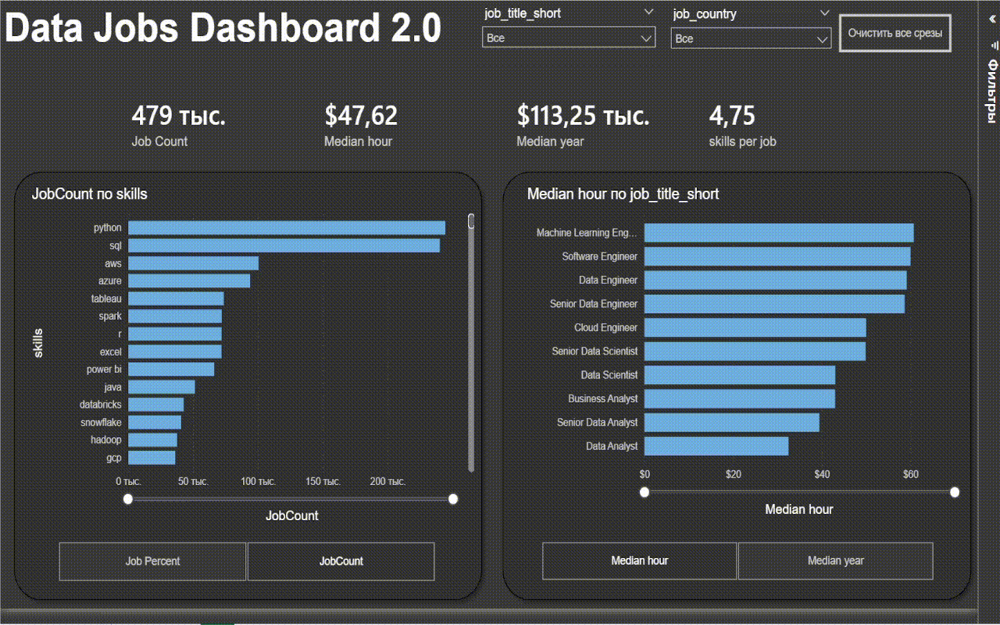
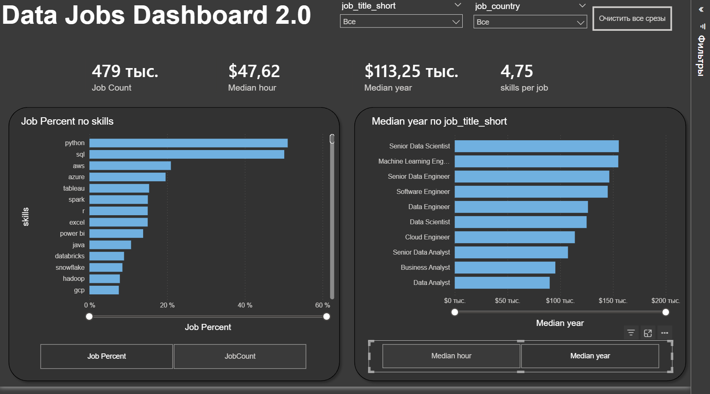

# Data Jobs Dashboard 2.0 w/ Power BI

## Introduction

Navigating the data job market can be challenging — information is often scattered across multiple sources. This dashboard (V2.0) was created for **job seekers, career switchers, and professionals exploring new opportunities** to quickly understand key market trends.

The project is based on a real-world dataset of data science job postings from 2024, including detailed information on roles, salaries, and locations. The result is a clean, single-page dashboard designed for efficient job market and compensation analysis.

## Dashboard File

[`DashboardN2.pbix`](DashboardN2.pbix)

---

## Skills Showcased

This project demonstrates the following Power BI capabilities:

- 🎨 **Dashboard Design** — intuitive and visually appealing layout  
- ⚙️ **Power Query (ETL)** — data cleaning and transformation  
- 🔗 **Data Modeling** — Star Schema implementation  
- 🧮 **DAX Fundamentals** — calculated measures and aggregations  

### Visualizations

- 📈 Bar, line, and area charts for trends and comparisons  
- 🗺️ Map visualizations for geographic insights  
- 🔢 KPI cards for key metrics  
- 📋 Tables for detailed breakdowns  
- 🎨 Multiple chart types for effective storytelling  

### Interactivity

- 🎚️ Slicers for dynamic filtering  
- 🔘 Buttons and bookmarks for navigation and drill-through  

---

## Dashboard Overview (Version 2.0 – Single Page Focus)

Version 2.0 consolidates all insights into a **single, focused dashboard page** that provides a quick overview of the data job market.

### Key Metrics

- Job Count  
- Skills per Job  
- Median Yearly Salary  
- Median Hourly Salary  

### Key Insights

- Skill demand (by percentage or job count)  
- Salary comparison across job roles  

---

## Conclusion

This dashboard demonstrates how Power BI can transform raw job market data into a practical analytical tool.

It enables users to explore key insights on a single page and supports more informed decision-making when planning their next career move.